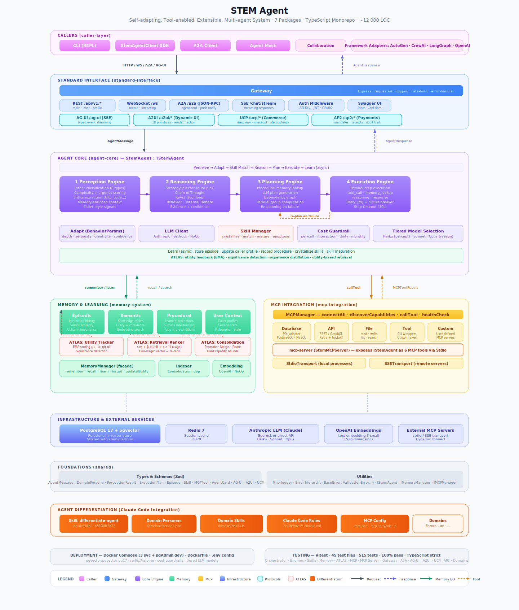

# STEM Agent

**Self-adapting, Tool-enabled, Extensible, Multi-agent System**

A modular AI agent architecture inspired by biological pluripotency. Like a stem cell that differentiates into specialized cell types, the STEM Agent starts as an undifferentiated core and specializes through environmental signals: MCP tool servers provide domain capabilities, caller interactions shape behavioral adaptation, and recurring patterns crystallize into reusable skills.

## Key Features

- **Multi-protocol gateway**: Five interoperability protocols (A2A, AG-UI, A2UI, UCP, AP2) behind a single Express.js gateway, plus four framework adapters (AutoGen, CrewAI, LangGraph, OpenAI Agents SDK)
- **Eight-phase cognitive pipeline**: Perceive, Adapt, Skill Match, Reason, Plan, Execute, Learn (with ATLAS utility feedback + experience distillation), Respond
- **Skills acquisition**: Biologically-inspired skill lifecycle where interaction patterns crystallize into reusable skills that mature (progenitor, committed, mature) or undergo apoptosis on persistent failure
- **Self-adaptive behavior**: Caller Profiler learns user preferences across 20+ dimensions via exponential moving averages, tuning 10 behavior parameters per request
- **Four-type memory system with ATLAS self-learning**: Episodic (interaction history with vector search), semantic (knowledge triples), procedural (learned strategies), and user context (caller profiles with GDPR forget-me). Memories are actively scored via utility feedback (EMA), retrieved with reinforcement-guided ranking (similarity + utility + recency), and consolidated through three-phase promote/merge/prune with hard capacity bounds
- **MCP-native tool integration**: All domain capabilities acquired at runtime via Model Context Protocol; agent reasoning stays domain-agnostic
- **Commerce protocols**: Novel UCP (checkout sessions, idempotency) and AP2 (payment mandates, audit trails)
- **Pluggable security**: JWT, OAuth2, SAML, API Key authentication with TTL-based policy caching and rate limiting

## Architecture



The architecture is organized into five layers, each a distinct concern. The Agent Core (Layer 3) is the undifferentiated core that differentiates through protocol handlers (Layer 2) and tool bindings (Layer 5) into specialized capabilities, while Memory (Layer 4) provides persistent state that guides future adaptation.

For multi-agent orchestration, see [stem-platform](../../stem-platform), which composes multiple STEM Agent instances into complex workflows through delegation, consensus, pipeline, and swarm collaboration patterns.

## Quickstart

```bash
# 1. Clone and install
git clone <repo-url> && cd stem-agent
npm install

# 2. Start infrastructure
docker compose up -d postgres redis

# 3. Set environment (copy env.example to .env and edit)
cp env.example .env
# At minimum, set AWS_REGION for Bedrock or ANTHROPIC_API_KEY for direct API

# 4. Build
npm run build

# 5. Run the agent
node packages/standard-interface/dist/index.js

# 6. Test with CLI
node packages/caller-layer/dist/human/cli.js

# 7. Or run the full demo
./scripts/demo.sh
```

## Packages

| Package | Layer | Description |
|---------|-------|-------------|
| `shared` | -- | Shared types, errors, logger |
| `packages/mcp-integration` | 5 | MCP server management, tool discovery |
| `packages/memory-system` | 4 | Episodic, semantic, procedural memory + ATLAS self-learning |
| `packages/agent-core` | 3 | Perception, reasoning, planning, execution |
| `packages/standard-interface` | 2 | REST, WebSocket, A2A, AG-UI, A2UI, UCP, AP2 gateway |
| `packages/caller-layer` | 1 | CLI, web dashboard, SDKs |

## API Endpoints

| Method | Path | Description |
|--------|------|-------------|
| GET | `/.well-known/agent.json` | A2A Agent Card discovery |
| POST | `/a2a` | A2A JSON-RPC 2.0 endpoint |
| POST | `/api/v1/chat` | Send a chat message |
| POST | `/api/v1/chat/stream` | Streaming chat (SSE) |
| WS | `/ws` | WebSocket real-time chat |
| GET | `/api/v1/agent/profile/:id` | Caller profile |
| GET | `/api/v1/agent/behavior` | Current behavior parameters |
| GET | `/api/v1/mcp/tools` | List available MCP tools |
| POST | `/ag-ui` | AG-UI SSE streaming (typed events) |
| POST | `/a2ui/render` | A2UI dynamic surface rendering (SSE) |
| POST | `/a2ui/action` | A2UI client action handler |
| GET | `/.well-known/ucp` | UCP discovery profile |
| POST | `/ucp/checkout-sessions` | UCP create checkout session |
| GET | `/ucp/checkout-sessions/:id` | UCP get checkout session |
| POST | `/ucp/checkout-sessions/:id/complete` | UCP complete checkout |
| POST | `/ap2/mandates/intent` | AP2 create intent mandate |
| POST | `/ap2/mandates/payment` | AP2 create payment mandate |
| POST | `/ap2/mandates/payment/:id/approve` | AP2 approve payment |
| POST | `/ap2/mandates/payment/:id/reject` | AP2 reject payment |
| GET | `/ap2/receipts/:id` | AP2 get payment receipt |
| GET | `/ap2/audit/:intentId` | AP2 audit trail |

## Configuration

Configuration is loaded from `config.yaml` at the project root. Key sections:

- **agent** — Agent identity (id, name, version)
- **llm** — Model provider and tiering (perception, reasoning, planning, formatting, evaluation)
- **embedding** — Embedding provider and model
- **mcp_servers** — MCP server definitions (transport, command, args)
- **persistence** — PostgreSQL connection
- **memory** — Working memory capacity, consolidation interval
- **cost** — Budget limits (per-interaction, per-user daily, monthly)
- **server** — Host, port, concurrency

See `stem-agent-design.md` Section 12 for the full reference.

## Docker Compose Profiles

```bash
# Infrastructure only (postgres + redis)
docker compose up -d

# Dev mode (adds pgAdmin)
docker compose --profile dev up -d

# Production (includes stem-agent service)
docker compose --profile prod up -d
```

## Development

```bash
npm run build        # Build all packages
npm run test         # Run all tests
npm run typecheck    # Type-check all packages
npm run clean        # Remove dist directories
```

## License

See LICENSE file.
